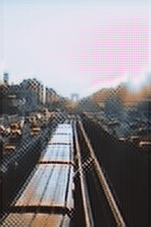
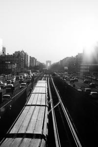

# colouriser
My AI Project to colorise images, it is based on the awesome pytorch-cyclegan project https://github.com/Lornatang/CycleGAN-PyTorch

State Changes:

I changed the train.py file to a stripped down library version it uses function params instead of command line args.
I added new test/setup scripts and a custom dataset.

If you want to change the dataset size change:

for i in tqdm(range(0,500)): <--- Change the 500 to the number of images you want in data/download.py

